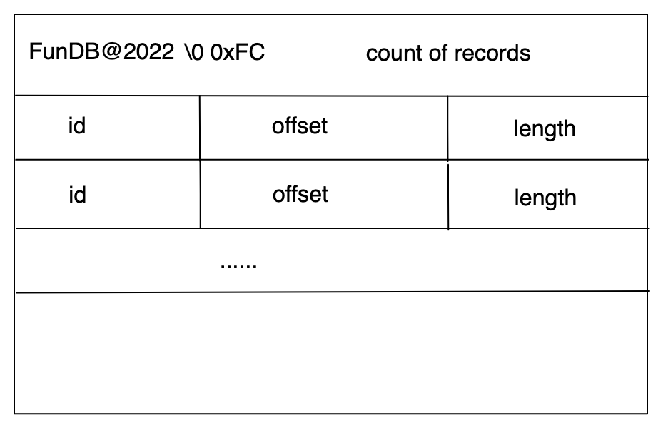
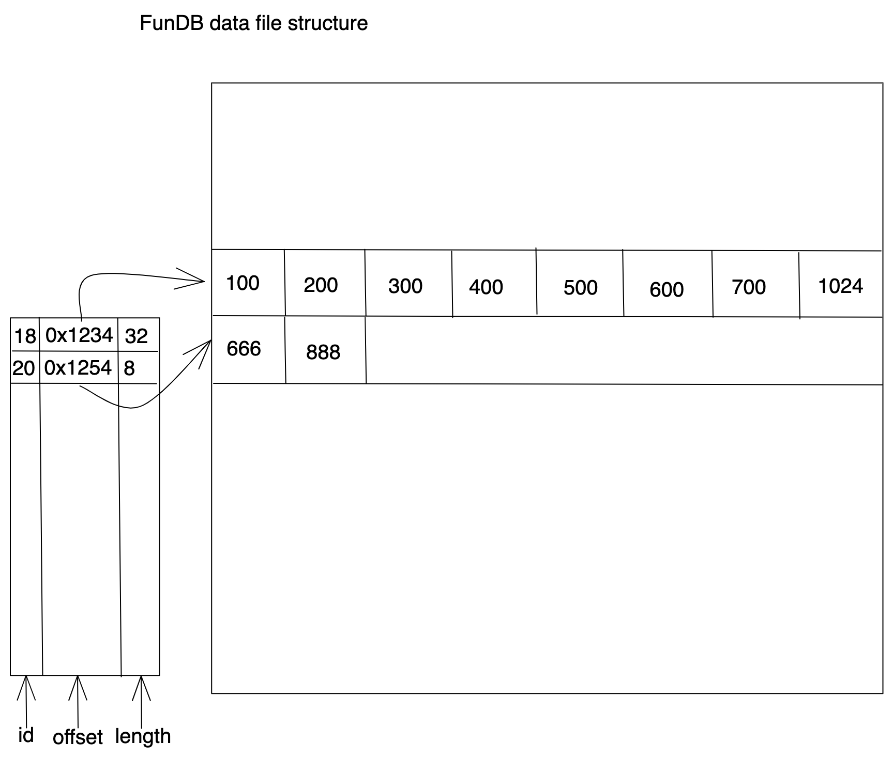

### Design database binary files to store metadata and real data for FunDB

Last time we wrote real data into data file by appending, that's cool. At least we have `INSERT INTO` capability in FunDB. However we cannot manipulate data in that format.

So we'd design a new data file format. Before that we'd check out what data is we really interted in.

### What kind of data we store in FunDB

We're going to implement a storage engine which save a list of value for a specific key, like `List` in `Redis`. So the logical data would look like

Table 1: logical data for each row

|id |val  |
--- | --- |
|1|12,34,118,874|
|2|443,8080|

We'll split this data into two pieces, one is `id` with offset and count of `val`; the other is the real data of `val`. Let's call the first part as `metadata`, and the second as `data`.
When we open a FunDB table, we'll read `metadata` from meta file, and read raw `data` from data file and lastly we construct a memory buffer to hold `id` and `val` pair.

### Metadata file format for a FunDB table
For metadata file `*.fmd`, we'll split it into two parts: first part is metadata header in which we have reserved string and count of rows (count of `id`)
Part1: metadata header section

|reserved (12 bytes) |count (4 bytes)  |
--- | --- |
|FunDB@2022'\0'0xFc|2|

Part2: metadata data sections

|id (4 bytes) |offset (4 bytes)   | length (4 bytes)  |
--- | --- | ---|
|1 | 0 |16|
|2 | 16 |8|

Part2 is the metadata for rows in above Table1.

### Data file format for a FunDB table
In metadata data sections, we have the offset for binary data of a row and its length. The data file is quite simple that we put values for a key with a continous binary data.
Binary data for above Table1

|(4 bytes) |(4 bytes) | (4 bytes) |(4 bytes) |
--- | --- | ---|---|
|12|34|118|874|
|443|8080|||

metadata file format:

lookup data from metadata:

Next, we'd read rows by `SQL` from FunDB.
[Read all rows from FunDB](./readrows.md)

